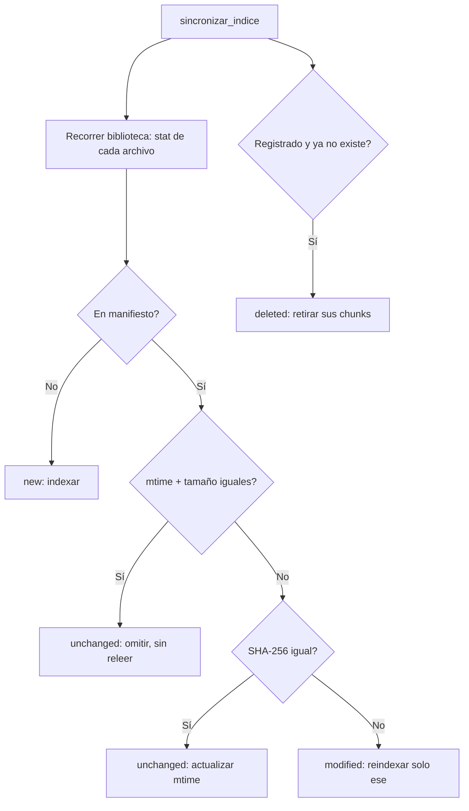

# Indexación incremental de Atlas

**Estado:** Implementado (primer corte de Atlas v4.1)
**Módulos:** `core/indexer.py`, `core/index_manifest.py`, `core/vector_store.py`, `core/local_ingestion_manager.py`
**Interfaces:** comando `!indexar` / `!indexar sync` (CLI y Streamlit), ingestión local de archivos

## 1. Problema original

Hasta Atlas v4.0, cada ingestión de un archivo local terminaba invocando
`construir_indice()`, que recorría **toda** `memory/Atlas_Memory`:

- abría todos los archivos anteriores;
- volvía a extraer su contenido;
- volvía a fragmentarlos;
- volvía a enviarlos a ChromaDB;
- recalculaba embeddings de documentos que no habían cambiado.

El costo de ingerir un archivo crecía con el tamaño total de la biblioteca.
Además, la identidad del documento no era estable: el indexador pasaba
`doc_id = ruta relativa` pero guardaba `nombre = basename` en la metadata,
mientras el borrado previo de `agregar_documento()` buscaba
`where={"nombre": doc_id}`. En subcarpetas no coincidían, así que
reindexar **duplicaba chunks** en lugar de reemplazarlos, y no existía
forma de retirar del índice un archivo eliminado del disco.

## 2. Flujo anterior


## 3. Flujo nuevo


Y para el mantenimiento:



## 4. Identidad de documentos

- La identidad es la **ruta relativa normalizada con `/`** respecto de
  `memory/Atlas_Memory` (ej.: `04_Universidad/Estadistica/clase_1.md`).
- Es estable, portable entre PCs y no depende de la ubicación absoluta
  del repositorio.
- Dos archivos con el mismo nombre en carpetas distintas son documentos
  distintos (`Derecho/clase_1.md` ≠ `Estadistica/clase_1.md`).
- Los chunks usan IDs deterministas: `{doc_id}:chunk:{i}`.
- Antes de insertar la versión nueva, se eliminan los chunks previos del
  mismo documento (esquema nuevo por `doc_id` y esquema antiguo por la
  metadata `ruta` con las variantes de separador del OS).

## 5. Manifiesto de indexación

Archivo local `vector_db/index_manifest.json` (gitignored, junto a la base
que describe; no contiene contenido de documentos).

```json
{
  "schema_version": 1,
  "embedding_model": "paraphrase-multilingual-MiniLM-L12-v2",
  "collection": "atlas_rag",
  "updated_at": "2026-07-21T00:00:00+00:00",
  "documents": {
    "03_Conocimiento/Materia/documento.md": {
      "content_sha256": "…",
      "size_bytes": 12345,
      "modified_time_ns": 123456789,
      "indexed_at": "2026-07-21T00:00:00+00:00",
      "chunk_count": 42,
      "last_operation": "indexed",
      "last_error": null
    }
  }
}
```

- Escritura **atómica**: `index_manifest.json.tmp` → flush → fsync →
  `os.replace()`. Nunca se escribe sobre el único archivo válido.
- Si no existe, se empieza vacío (adopción inicial).
- Si está corrupto o el `schema_version` no coincide, se respalda como
  `index_manifest.json.corrupt-<timestamp>.bak`, se registra
  `INDEX_MANIFEST_CORRUPT` y se reconstruye vacío **sin tocar ChromaDB**.

## 6. Detección de cambios

1. **Atajo:** si `size_bytes` y `modified_time_ns` coinciden con el
   manifiesto, el archivo se omite sin abrirlo.
2. **Decisión definitiva:** si cambiaron mtime o tamaño, se compara el
   **SHA-256 del contenido**. Si coincide, sólo se actualiza el mtime en
   el manifiesto (no se reindexa). Si difiere, se reindexa ese documento.
3. No se usa MD5 para integridad del manifiesto. (El MD5 histórico de
   `local_ingestion_manager._generar_hash_archivo` sólo genera sufijos de
   nombre de archivo; no es una decisión de integridad.)

## 7. Eliminación

`eliminar_documento_indexado(relative_path)`:

- localiza los chunks por `doc_id` (esquema nuevo) y por las variantes de
  `ruta` (esquema antiguo);
- los elimina de ChromaDB y quita la entrada del manifiesto;
- devuelve cuántos chunks eliminó;
- es idempotente (`deleted` la primera vez, `not_found` después);
- no afecta documentos con el mismo basename en otras carpetas.

`sincronizar_indice()` la aplica automáticamente a todo documento
registrado en el manifiesto que ya no existe en disco.

## 8. Compatibilidad

- `construir_indice()` se conserva como alias de
  `reconstruir_indice_completo()` y mantiene su contrato (devuelve la
  lista de archivos indexados).
- `!indexar` sigue ejecutando una **reconstrucción completa** explícita.
- `!indexar sync` ejecuta la **sincronización incremental**.
- Las búsquedas (`buscar_relevante`, `buscar_por_nombre`,
  `busqueda_hibrida`) no cambiaron: la metadata `nombre` se sigue
  guardando igual que antes.
- `agregar_documento()` sin `doc_id` en metadata conserva el
  comportamiento histórico exacto (borrado previo por `nombre`).

## 9. Recuperación ante errores

- Fallo del loader o del backend al indexar: el documento queda en estado
  `failed` con el error, la sincronización continúa con el resto y el
  manifiesto **no registra un éxito inexistente** (si ya existía una
  entrada, se anota `last_error` sin tocar hash/mtime, de modo que la
  próxima sincronización lo reintenta).
- Fallo de indexación tras una ingestión local: el Markdown **no se
  borra**, la UI informa "guardado, pendiente de indexación" y una
  `!indexar sync` posterior lo recupera.
- Los errores se registran en `atlas_security.log` con tipo y mensaje;
  no hay `except Exception: pass` en el camino de indexación.

## 10. Benchmark

`scripts/benchmark_indexing.py` compara la lógica anterior (réplica del
bucle viejo: recorrer y reindexar todo) con la nueva, sobre fixtures
temporales con un backend fake (sin ChromaDB ni embeddings reales).
Valores obtenidos en el entorno de desarrollo (fake de 1,5 ms/doc):

| Escenario | Antes: reindexados | Después: reindexados | T. antes | T. después |
|---|---|---|---|---|
| A: 10 existentes + 1 nuevo | 11 | 1 | 0,031 s | 0,015 s |
| B: 100 existentes + 1 nuevo | 101 | 1 | 0,292 s | 0,018 s |
| C: 100 sin cambios | 100 | 0 | 0,290 s | 0,025 s |
| D: 100 existentes + 1 modificado | 100 | 1 | 0,278 s | 0,033 s |

Los tiempos del fake no representan la velocidad real de la PC; la
evidencia válida es la **reducción de operaciones** (archivos abiertos,
documentos indexados, llamadas al backend). La ganancia real crece con el
tamaño y el costo de los documentos (PDFs, embeddings reales).

## 11. Limitaciones conocidas

- **Chunks huérfanos del esquema anterior:** documentos indexados antes
  de v4.1 cuya metadata no permite identificarlos con precisión (por
  ejemplo, indexados con `doc_id` = ruta absoluta fuera del flujo del
  indexer) no se pueden retirar quirúrgicamente. Recomendación: ejecutar
  una reconstrucción completa explícita (`!indexar`) una única vez tras
  actualizar. No se ejecuta automáticamente.
- **La sincronización asume que el manifiesto y ChromaDB están
  consistentes.** Si la base se borra a mano pero el manifiesto queda, la
  sincronización omitiría documentos ya registrados. En ese caso, usar
  `!indexar` (reconstrucción) o borrar también el manifiesto.
- **La ingesta por URL (`core/ingestion_manager.py`) y el crawler
  (`core/web_crawler.py`) siguen invocando una reconstrucción completa**
  al finalizar. Quedaron fuera del alcance de este corte; son candidatas
  naturales para el siguiente.
- El manifiesto registra un único `embedding_model`/`collection`
  informativo; no fuerza reindexación si cambian (decisión postergada).

## 12. Decisiones descartadas

- **Base de datos nueva (SQLite) para el manifiesto:** descartada por
  alcance; un JSON atómico es suficiente para miles de documentos.
- **Detectar cambios sólo por mtime:** descartado; mtime cambia por
  copias/backsups sin cambio de contenido. SHA-256 es la decisión
  definitiva, mtime/tamaño sólo un atajo.
- **Usar el basename como identidad:** descartado; colisiona entre
  carpetas. La identidad es la ruta relativa normalizada.
- **Borrar y recrear la colección en la reconstrucción:** descartado por
  riesgo de pérdida de datos; la reconstrucción reemplaza por identidad.
- **Cambiar la ingesta URL y el crawler en este corte:** postergado para
  mantener el alcance pequeño y reversible.
